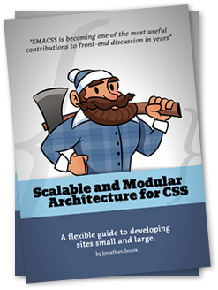

# Estudo de Caso – SMACSS

> **Aluno(a):** Vinicius de Araújo Silva
> **Turma:** Desenvolvedor Front-end
> **Data:** [28/07/2025]

---

## 1. Introdução

> Um guia flexível para o desenvolvolvimento de sites pequenos e grandes - Jonathan Snook

**SMACSS** (Arquitetura escalável e modular para css) é um método de organização que foca em tornar seu CSS escalável, modular(dividido em componentes) e mais compreensível. Esse método foca principalmente em dividir o seu CSS em 5 categorias: base, layout, modules, states e themes. Com essas categorias em mão e o entendimento de cada uma é possível começar a ver padrões no seu css e fazer uma estrutura fácil de construir e manter.

---

## 2. Aplicações e Benefícios

- Onde esse conceito é utilizado?
    - É utilizado na pasta styles no seu css e também afeta como se nomeia classes e ids no seu html e javascript.

- Quais problemas ele resolve?
    - Nomes mais claros para mais fácil entendimento.
    - Estrutura adaptável a qualquer tamanho de projeto.
    - Bom para o entendimento de todos em um projeto em equipe.

- Quais são as vantagens?
    - Escalabilidade.
    - Separação de estilos em componentes reutilizáveis.

---

## 3. Diferenças e Comparações
### OOCSS - Objected Oriented CSS
O próprio criador no livro diz ter se inspirado em OOCSS para criar o SMACSS.

Utiliza a mesma ideia de separar seu css em módulos reutilizáveis, só que de forma diferente. Os estilos são separados em estrutura e pele, sendo a estrutura a parte do tamanho e orientação (display flex, padding, width, ...) e a pele sendo a parte visual (color, border radius, font size, ...). Onde é possível ter, por exemplo, um botão com 3 classes no OOCSS, cada classe separada em arquivos diferentes:
```html
<button class="btn btn-primary btn-green">Clique aqui</button>
```
Nesse caso teriamos, btn sendo a estrutura e btn-primary, btn-green a pele:  
```css
/* Estrutura (dimensões e orientação) */
.btn {
    display: flex;
    justify-content: center;
    align-items: center;
    width: 50px;
    height: 25px;
    padding: 10px;
}

/* Pele (alteração visual) */
.btn-primary {
    font-size: 16px;
    font-weight: 600;
    color: black;
    background-color: blue;
}

.btn-green {
    color: white;
    background-color: green;
}
```
No SMACSS teremos apenas uma classe separada em pastas onde podemos separar, as cores, dimensões e tipografia:
```html
<button class="btn-primary">Clique aqui</button>
```
```css
/* pasta módulo */
.btn-primary {
    display: flex;
    justify-content: center;
    align-items: center;
    width: 50px;
    height: 25px;
    padding: 10px;
}

/* pasta fontes */
.btn-primary > button {
    font-size: 16px;
    font-weight: 600;
}

/* pasta cores */
.btn-primary > button {
    color: white;
    background-color: green;
}
```

Ou seja OOCSS tem a mesma intenção de tornar seu css modular, mas divide os componentes de forma diferente.

---

## 4. Exemplo Prático

Como exemplo prático podemos usar um header

```html
    <header>
        
        <div class="nav-header">
            <ul>
                <li><a href="">Home</a></li>
            </ul>
            <ul>
                <li><a href="">Shop</a></li>
            </ul>
            <ul>
                <li><a href="">About</a></li>
            </ul>
            <ul>
                <li><a href="">Contact</a></li>
            </ul>
        </div>
        <div class="button-wrapper">
            <button>login</button>
            <button>Sign-up</button>
        </div>
    </header>
```

É possível ver que o header possuí duas divs que separam conteúdos do header, esses mesmos podem ser considerados módulos já que podem ser utilizados em outras partes do site.

```css
header {
    display: flex;
    justify-content: space-between;
    align-items: center;
    
    width: 100%;
    height: 100px;
    padding: 29px 100px 30px 54px;
}
```

O header sendo um layout ele apenas define suas dimensões, enquanto outras partes que o compõem estarão separadas em outras pastas.

```css
.nav-header {
    display: flex;
    gap: 75px;
}

.nav-header a {
    font-size: 16px;
    font-weight: 600;
    color: var(--neutral-black)
}
```

```css
.button-wrapper {
    display: flex;
    gap: 45px;    
}

.button-wrapper button {
    width: 100px;
    height: 50px;
    border: 1px solid cyan;
}
```

Esses mesmos módulos então são estilizados separadamente para poderem ser reutilizados em outras partes do html.

Também é possível separar aspectos desse módulo em outras pastas como por exemplo a **fonte** e **cor**:

```css
.nav-header a {
    font-size : 16px;
    font-weight: 600;
}
```

A fonte sendo parte da **base** considerando que os links na página podem ser padronizados.

```css
.nav-header a {
    color: var(--neutral-black);
}

.button-wrapper button{
    border-color: cyan;
}
```
E sua cor na pasta **theme** 

E a pasta **main** para conectar tudo isso ao html:

```css
@import url(../base/fonts.css);
@import url(../layout/header.css);
@import url(../modules/nav-header.css);
@import url(../modules/nav-header.css);
@import url(../theme/colors.css);
```

### Estrutura da pasta

Exemplo de como ficaria essa estrutura dividida em pastas:
```
/styles
│
├── base/
│   └── fonts.css         
│
├── layout/
│   └── header.css        
│
├── modules/
│   ├── nav-header.css          
│   └── button-wrapper.css           
│
├── state/
│   └── hover.css        
│
├── theme/
│   └── colors.css               
│
└── main.css               
```

---

## 5. Conclusão

SMACSS é uma ótima forma de organizar seu css, especialmente se estiver trabalhando em grupo. Algumas coisas podem ser confusas como a pasta theme onde se quiser usar essa pasta separada ela normalmente vai ter as tipografias e cores, mas ao estudar um pouco mais fica mais claro as coisas. E a melhor parte é sobre não ser um método tão restrito, não quer organizar em várias pastas? Sem problema! você pode fazer tudo em um arquivo contanto que divida as categorias de forma correta. Ou seja, é um método flexivel onde se você não quiser fazer algo... Não faça!O importante é manter as divisões por categorias e a convenção de nomenclatura tudo bem!

Como recomendações, não faça um projeto tão longo quanto esse aqui enquanto está aprendendo, pode ficar muito confuso muito rápido. Comece fazendo tudo em uma pasta e separando por categorias e quando estiver pronto, ou quando achar que seu projeto está muito grande para um único arquivo, só então comece a trabalhar em pastas separadas por categoria.

---

## 6. Fontes utilizadas

- [Livro do criador](https://smacss.com)
- [Introdução básica ao SMACSS](https://youtu.be/0Nm8VoCN-M8?si=QAmmKWhHU0QTN9Cn)
- [Projeto utilizado do figma](https://www.figma.com/files/team/1486052385131181217/resources/community/file/1252561852327562039?fuid=1486052383188999805)

---

## 7. Slides da Apresentação

📎 Link para os slides:
[Slide/Vinicius/SMACSS](https://www.canva.com/design/DAGuNVVXf8A/Pw-vio3pYplDDX25rp03Ig/edit?utm_content=DAGuNVVXf8A&utm_campaign=designshare&utm_medium=link2&utm_source=sharebutton)

---

## Checklist de Entrega

- [x] Markdown com conteúdo autoral
- [x] Código funcional incluído
- [x] Fontes listadas
- [X] Slides prontos
- [X] Arquivo no GitHub
